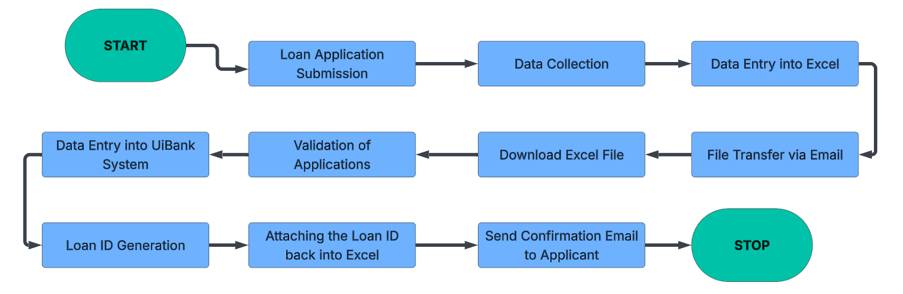
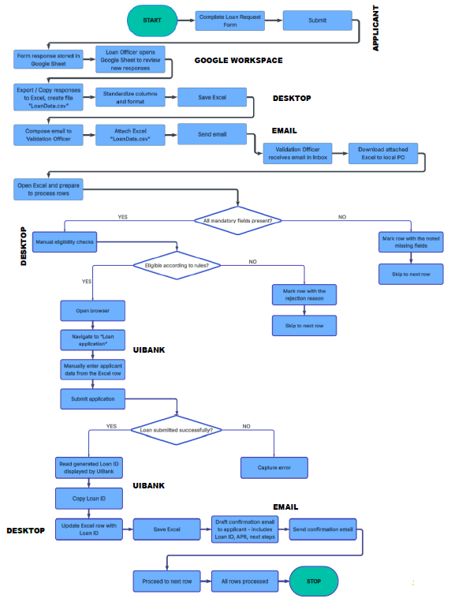
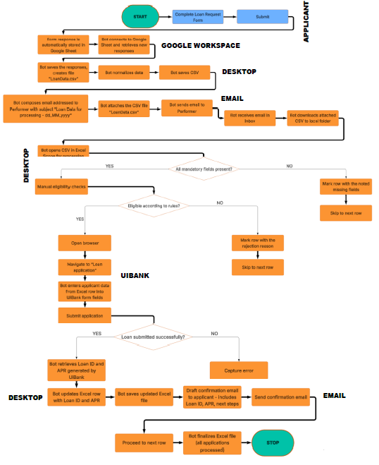

<h1 align="center">Loan Request Intake, Criteria Validation and Approval Automation</h1>

  <strong>UiPath automation for loan request intake, validation, approval support and applicant communication</strong> 
  Google Workspace integration, Excel and CSV processing, UiBank form automation and email-based workflow orchestration

  
  
  
  

  <strong>Author:</strong> Aris-Georgian ILIE

---

## TABLE OF CONTENTS

- [ABOUT THE PROJECT](#about-the-project)
- [PROJECT ORIGIN AND OWNERSHIP](#project-origin-and-ownership)
- [PROCESS DESIGN DOCUMENT](#process-design-document)
- [BUSINESS CONTEXT](#business-context)
- [AUTOMATION OBJECTIVE](#automation-objective)
- [AS-IS PROCESS](#as-is-process)
- [TO-BE AUTOMATED PROCESS](#to-be-automated-process)
- [PROCESS MAPS](#process-maps)
- [HOW THE AUTOMATION WORKS](#how-the-automation-works)
- [MAIN AUTOMATION COMPONENTS](#main-automation-components)
- [IN-SCOPE ACTIVITIES](#in-scope-activities)
- [OUT-OF-SCOPE ACTIVITY](#out-of-scope-activity)
- [INPUTS AND OUTPUTS](#inputs-and-outputs)
- [BUSINESS RULES AND VALIDATION LOGIC](#business-rules-and-validation-logic)
- [EXCEPTION HANDLING](#exception-handling)
- [APPLICATIONS AND TECHNOLOGY USED](#applications-and-technology-used)
- [EXPECTED BUSINESS IMPACT](#expected-business-impact)

---

## ABOUT THE PROJECT

<strong>Loan Request Intake, Criteria Validation and Approval Automation</strong> is a UiPath project that automates a loan processing workflow that starts from applicant-submitted loan requests and continues through data preparation, validation, entry into the bank system, result capture and confirmation email delivery. The solution connects several business tools into one automated flow, including Google Forms, Google Sheets, Gmail, Excel and the internal <strong>UiBank</strong> application. The overall design, business context, process mapping and exception logic are documented in the Process Design Document created for this project.

The automation addresses a process from <strong>Banking Operations</strong>, inside the <strong>Loan Management</strong> area. Before automation, the process required loan officers to manually collect form submissions, enter data into Excel, send files by email, validate each request against eligibility rules, retype approved applications into UiBank, record the generated Loan ID and then send a confirmation email to the applicant. The PDD describes this manual flow and the intended automated version in detail.

---

## PROJECT ORIGIN AND OWNERSHIP

A defining part of this project is that the <strong>automation idea itself was proposed by me</strong>. This is not only an implementation exercise, but also a process improvement initiative that I designed from the business analysis stage. I identified the manual bottlenecks in the loan intake and approval-support workflow, structured the automation opportunity, defined the target flow and translated the process into a UiPath-ready solution concept.

In addition to proposing the idea, I also created the full <strong>Process Design Document</strong> for the automation. This makes the repository important not only as a technical automation project, but also as evidence of end-to-end ownership from process analysis to automation design.

---

## PROCESS DESIGN DOCUMENT

The complete Process Design Document created by me is available in the repository and serves as the main reference for the automation. It contains the process description, business objectives, applications used, process maps, input data description, scope boundaries, business exceptions and application exception handling. The PDD is the foundation that explains how the automation should work and why each component exists.

Open the full PDD here:

  <a href="documentation/PDD_LOAN_REQUEST_INTAKE,_CRITERIA_VALIDATION_and_APPROVAL_AUTOMATION.pdf">
    Open the Process Design Document (PDF)
  </a>

---

## BUSINESS CONTEXT

According to the PDD, the process full name is <strong>Loan Request Intake, Criteria Validation and Approval Automation</strong>. It belongs to the <strong>Banking Operations</strong> process area and to the <strong>Loan Management</strong> department. The process is scheduled daily from Monday to Friday, between 9 AM and 6 PM. The documented operating volume is about <strong>90 loan requests per day</strong>, with peak periods reaching <strong>100 to 150 requests per day</strong>. Manual handling time is estimated at <strong>4 to 6 minutes per application</strong>, supported by approximately <strong>3 to 5 loan officers</strong>.

The PDD also notes an expected increase in future volume of around <strong>15 to 20 percent</strong>, which makes the case for automation even stronger. In this kind of workflow, repetitive validation and repeated data entry make the process time-consuming, error-prone and difficult to scale manually.

---

## AUTOMATION OBJECTIVE

The business objective of the solution is to automate the repetitive operational work that happens after an applicant submits a loan request. The PDD states the expected benefits clearly: reduce manual processing time by up to <strong>80 percent</strong>, increase accuracy and compliance through predefined business rule validation, improve traceability through logs and audit trails and improve customer experience by sending fast confirmation emails to approved applicants.

From a technical point of view, the automation is designed to collect form data from Google Workspace, standardize it into a local CSV or Excel-based processing file, validate each row, submit eligible applications to UiBank, capture the generated Loan ID and APR, update the local data file and notify approved applicants by email. The result is a complete transaction flow that reduces manual effort while preserving business control where needed.

---

## AS-IS PROCESS

In the manual version of the process, applicants submit their loan requests through a form. A loan officer later collects these responses and manually enters the data into Excel. The Excel file is attached to an email and sent to another colleague responsible for validation and system entry. That colleague downloads the file, opens it in Excel and checks each application against the bank’s eligibility criteria, such as age, income and requested loan amount. If the request is valid, the officer manually enters the data into UiBank, records the generated Loan ID and finally sends a confirmation email to the applicant. This manual flow is documented in the PDD under the As-Is section and in the attached high-level and detailed process maps.

---

## TO-BE AUTOMATED PROCESS

The To-Be process keeps the applicant submission step outside the automation, because it depends on direct customer input, but automates the operational steps that follow. The bot retrieves loan request responses from Google Sheets, normalizes the data, saves it to a standardized CSV file, sends it by email to the performer stage, downloads the file, validates the contents, marks incomplete or rejected applications with reasons, submits eligible applications into UiBank, captures the generated Loan ID and APR, updates the processing file and sends a confirmation email to approved applicants. The To-Be process map in the PDD and the dedicated to-be process image show this transformation clearly.

---

## PROCESS MAPS

### High-Level As-Is Process Map

  

This high-level map summarizes the original manual workflow, starting from loan application submission and ending with sending a confirmation email to the applicant. It shows the sequence of manual collection, file transfer, validation, UiBank entry, Loan ID generation and communication. It corresponds to the As-Is process map section documented in the PDD.

### Detailed As-Is Process Map

  

This detailed map breaks the manual process into its operational steps across the applicant, Google Workspace, desktop, email and UiBank layers. It highlights where officers manually review responses, create and send files, validate mandatory fields, check eligibility, submit to UiBank and write confirmation messages. It is especially useful for understanding which manual actions were selected as the primary automation targets.

### Detailed To-Be Process Map

  

This map shows the automated target state. It makes clear where the bot replaces manual actions: retrieving responses, converting and normalizing data, sending the processing file, validating rows, entering data into UiBank, capturing outputs and sending confirmation emails. It visually expresses the business logic that was formalized in the PDD and then implemented in the UiPath project.

---

## HOW THE AUTOMATION WORKS

The automation begins after the applicant has already submitted a loan request through Google Forms. Those responses are stored automatically in Google Sheets. The first automation stage retrieves the responses from the sheet, converts them into a structured local file and standardizes the format for downstream processing. The process map shows this part as the Google Workspace and desktop preparation phase.

Once the file is prepared, the automation uses email as a handoff mechanism between process stages. The standardized CSV is attached to an email and sent to the performer stage. The performer downloads the attachment locally, opens it in an Excel processing scope and begins row-by-row validation. This is where the bot checks mandatory fields and applies eligibility rules before any submission is made into UiBank.

If mandatory information is missing, the row is marked with the reason for disqualification and skipped. If all required fields are present but the applicant is not eligible according to the defined business rules, the row is marked with the rejection reason and skipped. Only eligible applications continue to the UiBank stage.

For eligible rows, the bot navigates to the UiBank loan application page and enters the applicant data into the system. After submission, it retrieves the generated Loan ID and APR from the confirmation screen, updates the processing file with those values, saves the updated file and prepares a confirmation email. The confirmation email includes the Loan ID, APR and next steps, and is sent to the approved applicant. The bot then proceeds to the next row until all requests in the batch are processed.

---

## MAIN AUTOMATION COMPONENTS

### 1. Intake and response retrieval

The first component retrieves application data from Google Forms responses stored in Google Sheets. This stage transforms the initial applicant input into a machine-usable processing source for the automation. The PDD describes Google Forms and Google Sheets as structured and standardized inputs.

### 2. Data standardization and file generation

After response retrieval, the automation normalizes the structure and creates a CSV processing file. This creates a stable intermediate format that can be validated, annotated and reused throughout the rest of the process.

### 3. Email transfer layer

The file is sent by email to the performer stage, where it is downloaded and prepared locally. This models a real business handoff and demonstrates bot interaction with mail systems as part of a business workflow.

### 4. Validation engine

The performer checks mandatory fields first, then applies business eligibility rules. The bot records rejection or disqualification reasons directly in the processing file so the final output preserves a full audit trail for each row. The PDD lists the mandatory fields and known business exceptions that drive this logic.

### 5. UiBank submission

Eligible applications are entered into the internal UiBank loan application page. This step demonstrates browser-based system automation and structured form filling within a banking context.

### 6. Result capture and file update

After successful submission, the bot retrieves the generated Loan ID and APR, writes them back into the processing file and saves the updated document.

### 7. Applicant notification

For approved applications, the bot drafts and sends a confirmation email containing the Loan ID, APR and next steps. This closes the applicant-facing side of the transaction and improves customer responsiveness.

---

## IN-SCOPE ACTIVITIES

The PDD defines the automation scope very clearly. In scope are the following major activities: capturing responses from Google Sheets, saving loan data into a standardized CSV file, normalizing and formatting the data, sending the CSV by email, downloading the CSV attachment, opening and processing the file, validating mandatory fields, applying eligibility rules, marking incomplete or rejected applications with reasons, navigating to the UiBank loan application page, entering the applicant data, submitting the application, retrieving the Loan ID and APR, updating the Excel row, saving the updated file, generating the confirmation email and looping through all applications until completion. These activities are explicitly listed in the In Scope section of the PDD.

---

## OUT-OF-SCOPE ACTIVITY

The PDD identifies one core activity as out of scope: the applicant filling in the loan request form. This remains a manual external action because it depends on direct customer input. The automation starts after the applicant submission has already happened. This scope boundary is important because it clarifies that the project automates the operational processing pipeline, not the customer’s input action itself.

---

## INPUTS AND OUTPUTS

The PDD documents the input data at each major stage. Inputs include the original Google Form data, the automatically updated Google Sheet, the standardized CSV file and the processing rows in Excel. The structured fields include applicant name, age, email address, annual income, requested loan amount and loan term. Later processing steps add rejection reasons, Loan ID, APR and final status values. The output side of the process includes the updated processing file and the confirmation email sent to approved applicants.

---

## BUSINESS RULES AND VALIDATION LOGIC

A major strength of the project is that validation is documented as a formal rule set rather than left as informal checking. The PDD defines mandatory field validation and eligibility rule validation. Known business exceptions include cases such as missing email, invalid loan term values and incomplete records. Additional eligibility rules include rejection for applicant age below 18, loan amount greater than or equal to three times yearly income and loan amount greater than or equal to 100,000. In all these cases, the bot marks the application with the corresponding reason and skips to the next transaction instead of failing the whole batch.

---

## EXCEPTION HANDLING

The exception design is documented in the PDD in two categories: business exceptions and application or technical exceptions. Known business exceptions include no email provided by the applicant, email received without attachment, CSV file with no data and invalid loan term values. The expected actions are clearly defined, such as marking the row, skipping to the next one or stopping the batch when the input file itself is unusable.

Known technical exceptions include application crash or internal server error, timeout while loading the UiBank page and invalid selector or element not found during UiBank data entry. The PDD specifies recovery strategies such as retrying the action, restarting the application flow, marking the affected transaction and escalating if the issue persists. Unknown exceptions are handled through logging, notification, escalation and controlled continuation when possible. This makes the project not just operational, but also maintainable and resilient.

---

## APPLICATIONS AND TECHNOLOGY USED

The PDD lists the main applications used in the process: <strong>Gmail</strong>, <strong>UiBank</strong>, <strong>Excel</strong> and a manual email client, while the project presentation also highlights <strong>UiPath Studio</strong>, <strong>UiPath Orchestrator</strong> and <strong>UiPath Assistant</strong> as the core automation toolkit. The process maps also show the integration layers clearly: applicant input, Google Workspace, desktop processing, email transfer and UiBank submission. Together, these technologies make the project a strong example of cross-application RPA built on a realistic business workflow.

---

## EXPECTED BUSINESS IMPACT

The automation is designed to reduce handling time significantly, improve consistency in validation, reduce manual retyping, create better traceability and accelerate communication with applicants. Because the original process runs daily and already handles about 90 requests per day, even moderate time savings per item produce major operational gains over time. The documented goal of reducing manual effort by up to 80 percent shows the strategic value of the solution, especially under future volume growth.

